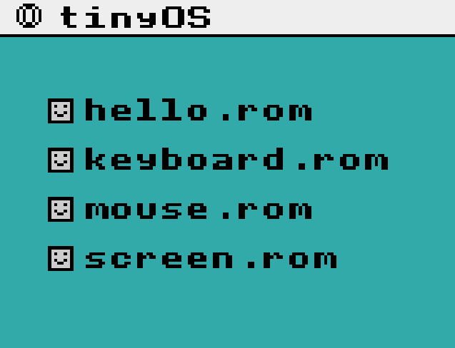

# bici - emulator & OS for fictional 8-bit CPU with 64kb memory

<table>
  <tr>
    <td></td>
    <td></td>
  </tr>
  <tr>
    <td></td>
    <td></td>
  </tr>
</table>


## Overview

**The [feature summary](#feature-summary) goes in depth on the points below, with GIFs and screenshots.**

I began this project with a working emulator, but with no interaction capability and with the only output mechanisms being console prints and plotting individual pixels on the screen. The assembly language was weird and limited.

My goals for the project period were to add or achieve the following:

1.  [x] An intel-inspired, clearer assembly syntax, with more convenience features
2.  [x] The ability to draw lines, rectangles, and 8x8 sprites
3.  [x] The ability to draw ASCII text
4.  [x] The ability to query mouse position and button state
5.  [x] The ability to query keyboard input
6.  [x] The ability to query the local filesystem
7.  [x] The ability to statically and dynamically set the four-colour system palette within ROMs
8.  [x] The ability to draw to the background layer (where the 0-colour is transparent) and the foreground layer
9.  [x] An operating system which is a ROM like any other and is programmed in the VM's assembly, not special-cased in the emulation code
10. [x] Said OS can act as a loader for ROMs
11. [x] Said OS can run ROMs without any changes to them (i.e. the ROMs can run unchanged both on "bare metal" and in the OS)
12. [ ] Said OS can window ROMs and run multiple ROMs concurrently, providing multitasking capability

I've achieved every goal except the last. I know how to enable multitasking and provide a "real" OS experience, but it'll require a couple changes to the emulator (albeit without special-casing the OS) and some rather complex assembly routines. I think I could have managed it had I had a couple more days.


## Codebase organisation

This is a monorepo containing the code for the assembler, emulator, example ROMs, and OS.

The assembler and emulator are written in C11. I don't use any libraries, and my personal standard library's software renderer interfaces with Win32 directly.

The code for the assembler begins [here](https://github.com/felix-u/bici/blob/master/src/main.c#L700) and the code for the emulator begins [here](https://github.com/felix-u/bici/blob/master/src/main.c#L1290).

The assembly code for the example programs is in [`hello.asm`](./hello.asm), [`keyboard.asm`](./keyboard.asm), [`mouse.asm`](./mouse.asm), and [`screen.asm`](./screen.asm). The OS is implemented in [`os.asm`](./os.asm). For convenience, all assembly programs include [`header.asm`](./header.asm), which I elaborate on [later](#headerasm).


## Compilation and usage

I want to get my software renderer up and running on Linux and web in the near future, but for now I've only implemented it for Win32, so that's the only compilation target for `bici`.

With the MSVC toolchain installed, run `build.bat`. You can also run `build.bat clang`. Either of these commands will produce `build/bici.exe`.

Usage: `bici <com|run|script> <file...>`, meaning one of:
```sh
bici com file.asm file.rom
bici run file.rom
bici script file.asm # compile and run in one go
```


## CPU reference

The `bici` CPU is 8-bit, with 16-bit operations. It has 64kb of memory and two 256-byte stacks: a working stack, for intermediate values and parameters, and a return stack which in practice is used as a call stack.

`bici` has 35 opcodes. Each instruction is one byte, consisting of a 5-bit opcode and 3 mode bits:
```cpp
bits {
    opcode: 5
    size:   1 // 0 if 8-bit, 1 if 16-bit
    stack:  1 // 0 if working stack, 1 if return stack
    keep:   1 // 0 if parameters are popped, 1 if parameters are kept
}
```


5 bits only allows for 32 operations, but not all opcodes support all modes so to get 35, I "overloaded" operations which didn't need all their mode bits. Since `push` takes an immediate, without popping any value, I used its `keep` variants (`push.k`, `push.2k`, and `push.kr`) as the byte values for 3 immediate jumps, which also have no use for the mode bits.

The opcode values are defined as an X-list, [here](https://github.com/felix-u/bici/blob/master/src/main.c#L6).

In the following table, the left-to-right stack value notation corresponds to bottom-to-top positions. Unsuffixed values are assumed to be the bit-width indicated by the instruction's size mode bit, while `n`-suffixed values are `n` bits wide regardless of the instruction mode. `{ret: ...}` notation indicates return stack manipulation. `{}` notation indicates modification to `pc`, the program counter. `mem[]` notation indicates memory read.

| Opcode | Stack before | Stack after                          | Takes immediate? |
| ------ | ------------ | -----------                          | ---------------- |
| break  |              |                                      | yes              |
| push   |              | immediate                            |                  |
| drop   | a b          | a                                    |                  |
| nip    | a b          | b                                    |                  |
| swap   | a b          | b a                                  |                  |
| rot    | a b c        | b c a                                |                  |
| dup    | a            | a a                                  |                  |
| over   | a b          | a b a                                |                  |
| eq     | a b          | (a == b)8                            |                  |
| neq    | a b          | (a != b)8                            |                  |
| gt     | a b          |  (a > b)8                            |                  |
| lt     | a b          | (a < b)8                             |                  |
| add    | a b          | (a + b)                              |                  |
| sub    | a b          | (a - b)                              |                  |
| mul    | a b          | (a * b)                              |                  |
| div    | a b          | (a / b)                              |                  |
| inc    | a            | (a + 1)                              |                  |
| not    | a            | ~a                                   |                  |
| and    | a b          | (a & b)                              |                  |
| or     | a b          | (a \| b)                             |                  |
| xor    | a b          | (a ^ b)                              |                  |
| shift  | a b          | b << ((a & 0xf0) >> 4) >> (a & 0x0f) |                  |
| jmp    | a.16         | { pc = a.16 }                        |                  |
| jme    | a b.16       | if (a) { pc = b.16 }                 |                  |
| jst    | a.16         |  {ret: pc} { pc = a.16 }             |                  |
| jne    | a b.16       |  if (!a) { pc = b.16 }               |                  |
| jni    | a            | if (!a) { pc = immediate.16 }        | yes              |
| stash  | a            | {ret: a}                             |                  |
| load   | a.16         | mem[a.16]                            |                  |
| store  | a b.16       | mem[b.16] = a                        |                  |
| read   | a            | mem[a]                               |                  |
| write  | a b          | mem[b] = a                           |                  |
| jmi    |              | { pc = immediate.16 }                | yes              |
| jei    | a            | if (a) { pc = immediate.16 }         | yes              |
| jsi    |              | {ret: pc} { pc = immediate.16 }      | yes              |

The first 256-byte page of the 64kb address space - the 0 page, or the device page - is reserved for special device operations using the `read` and `write` operations.

When interacting with the device page, we use `read` and `write` rather than `load` or `store` because the CPU intercepts these operations and may need to query the relevant values or perform device operations, before populating the relevant device page address or pushing a value from the device page onto the stack.

Each device has 16 bytes reserved in the device page, which can be used for a combination of 8-bit and 16-bit values or operations. At the moment there are [6 devices](https://github.com/felix-u/bici/blob/master/src/main.c#L45): `system`, `console`, `screen`, `mouse`, `keyboard`, and `file` (implemented in [these](https://github.com/felix-u/bici/blob/master/src/main.c#L264) [portions](https://github.com/felix-u/bici/blob/master/src/main.c#L418) of the emulator).

See the [`draw_text` routine](https://github.com/felix-u/bici/blob/master/header.asm#L102) in `header.asm` for an example of using the `screen` devices to render text.

When a ROM is executed, `bici` sets the program counter to the address stored at `system_start` in the device page and [executes](https://github.com/felix-u/bici/blob/master/src/main.c#L1291) until a `break` instruction is encountered.
Then, every frame, `bici` reads the address at `screen_update` in the device page, and [executes](https://github.com/felix-u/bici/blob/master/src/main.c#L1295) from that address until `break`. Finally, upon emulator quit, `bici` [executes](https://github.com/felix-u/bici/blob/master/src/main.c#L1299) the address at `system_quit` in the device page until a `break`.


## Assembly language reference

I've tried to emulate intel assembly syntax, with a few differences.

* Instructions are compiled via their opcode, and may be suffixed with modes `.2kr` (any combination following `.`). For example, to jump to the topmost address on the return stack (i.e. to return), write `jmp.r`. Some instructions take an immediate, as in `push label_or_number`.
* Number literals are either hexadecimal (`0x1234`) or binary (`0b01`).
* There may be multiple instructions on one line, for compactness (most instructions take no arguments, operating on the stack).
* Global labels are defined as `label:`, and local labels are defined as `/label:`. Local labels are only visible between the preceding global label and the next global label.
* Comments are from any `;` character to the end of the line.
* A `{ ... }` pair will compile the 16-bit address of `}` at the location of `{`. Therefore, the equivalent of C's `if (1) { ... }` is `push 0x1 jni { ... }`, which is the same as `push 0x1 jni end ... end:`.
* Any `[ ... ]` indicates insertion mode, where string literals (`"Hello"`) and numbers are compiled directly into the binary at the current compilation offset. If the opening `[` is suffixed with `$`, as in `[$ ... ]`, then the offset between the opening `[` and closing `]` (i.e. the total number of bytes inserted) is compiled at the location of `[$` as an 8-bit relative offset. This is useful for strings, as in `[$ "Hello" ]`, which is equivalent to `[ 0x5 "Hello" ]`.

There are a few directives:

* `include "file.asm"`, equivalent to C's `#include "file.c"`.
* `org number` sets the compilation offset to `number`.
* `rorg number` increments the compilation offset by `number`.
* `patch label, label_or_number` compiles the value of `label_or_number` to the address of `label`, without changing the compilation offset. This allows device page labels to be defined in `header.asm` and then patched in assembly files which include it.


## Programming for `bici`

### Hello, World!

Using the `console_print` device:
```asm
include "header.asm"

patch system_start, start
start:
    push.2 hello
    push console_print
    write.2
    break

    /hello: [$ "Hello, World!" ]

EOF:
```


Using the `screen` devices for graphical text rendering:
```asm
include "header.asm"

patch system_colour_0, 0xfa4
patch system_colour_1, 0x100

patch screen_update, update
update:
    ; clear background
    push.2 0x0 push screen_x write.2
    push.2 0x0 push screen_y write.2
    push 0b11000000 ; set fill_x and fill_y bits to draw rectangle, with colour 0
    push screen_pixel
    write

    push.2 hello
    push.2 0x108 ; x
    push.2 0xa0  ; y
    push 0b00000100 ; text foreground = colour 01, background = colour 00 (transparent)
    jsi draw_text ; helper routine defined in "header.asm" uses screen_sprite device

    break

    /hello: [$ "Hello, World!" ]

EOF:
```


### Routine call & return convention

Routines end in `jmp.r`, a jump to the topmost address on the return stack. A comment of the form `; (parameters -> results)` indicates what the routine expects on the stack, and what it will push.
Example routine [from `header.asm`](https://github.com/felix-u/bici/blob/master/header.asm#L48):
```asm
cast_u16_from_u8: ; (value: u8 -> u16)
    push 0x0 swap
    jmp.r
```

Callers use `jsi`, or "jump stash return immediate", to stash the current program counter on the return stack and jump to the immediate address.
Example call:
```asm
push 0x0 ; parameter = (u8)0
jsi cast_u16_from_u8 ; stack now holds (u16)0
```

### `header.asm`

For convenience, common labels and routines are defined in `header.asm`. This includes device page labels:
```asm
system:
    rorg 0x2 ; address 0 reserved
    system_end:      rorg 0x2
    system_start:    rorg 0x2
    system_quit:     rorg 0x2
    system_colour_0: rorg 0x2
    system_colour_1: rorg 0x2
    system_colour_2: rorg 0x2
    system_colour_3: rorg 0x2

org 0x10 console:
             console_print:

org 0x20 screen:
    screen_update: rorg 0x2
    screen_width:  rorg 0x2
    ; ...
```
the directive to begin user routines only after the first 256 (0x100) bytes, which is the reserved device page:
```asm
org 0x100
```
the expectation that programs will declare an `EOF` label indicating the size of the ROM, to store in the `system_end` port:
```asm
patch system_end, EOF
```
helpful routines:
```asm
draw_default_mouse_cursor_at_mouse: ; (colour: u8 -> _)
    push mouse_x read.2
    push screen_x write.2

    push mouse_y read.2
    push screen_y write.2

    push.2 mouse_cursor_sprite
    push screen_data write.2

    push screen_sprite write

    jmp.r
```
and common sprites, such as the mouse cursor and the font:
```asm
font:
    rorg 0x100 ; skip to ' ' * 8 (bytes per glyph), i.e. the first visible ASCII character
    /space: rorg 0x8
    /exclamation: [
        rorg 0x1
        0b00011000
        0b00011000
        0b00011000
        0b00011000
        0b00000000
        0b00011000
        0b00011000
    ]
    /double_quote: [
        rorg 0x1
        0b00000000
        0b01101100
        0b01101100
        0b01101100
        0b01101100
        0b00000000
        0b00000000
    ]
    ; ...
```

### Local labels as variables

I find it quite difficult to reason about three or more items on the stack. To make programming `bici` easier, I sometimes use local labels (i.e. `/label:`) to store named local variables *below* a routine's `break` or `jmp.r` (such that the stored values cannot be accidentally executed as code). The `rorg` (relative compilation offset) directive allows me reserve the correct number of bytes for each variable.

I access these "local variables" with `push.2 variable_address load` and `push new_value push.2 variable_address store`.

You can see this pattern in several of my routines. For example, in [`draw_text`](https://github.com/felix-u/bici/blob/master/header.asm#L102):
```asm
draw_text: ; (string_address, x, y: u16, text_colour: u8 -> _)
    push.2 text_colour store

    ; [OMITTED]

    ; store character count
    dup.2
    load
    push.2 count store

    ; store address of first character
    inc.2
    push.2 address store.2

    push.2 0x0
    /loop:
        dup.2

        push.2 count load
        push 0x0 swap ; cast to u16

        lt.2
        jni {
            dup.2
            push.2 index store.2

            dup.2

            ; load address
            push.2 address load.2

            ; [OMITTED]

            ; draw
            push.2 text_colour load
            push screen_sprite
            write

            ; [OMITTED]
        }
        drop.2

    jmp.r

    /text_colour: rorg 0x1
    /count: rorg 0x2
    /index: rorg 0x2
    /address: rorg 0x2
```

This is definitely slower than stack manipulation, and I could also try `stash` to use both stacks at once. However, performance isn't a problem, and I think this is by far the more readable solution.

### Special routines

Recall the three special routines `system_start`, `system_quit`, and `screen_update`, which are executed by the emulator upon ROM load, upon quit, and once per frame, respectively. These routines end in `break` rather than `jmp.r`.

To patch the correct device page addresses without having to redefine those values in every program, the special addresses are defined in `header.asm`, and programs use the `patch` directive as follows:
```asm
include "header.asm"

patch system_start, start
start:
    ; ...
    break

patch system_quit, quit
quit:
    ; ...
    break

patch screen_update, update
update:
    ; ...
    break
```

Because the `break` instruction has a byte value of `0`, and because the assembler guarantees that untouched bytes remain 0, all of these routines are optional. For example, if you don't patch `screen_update`, `bici` reads 0 and goes to execute at address 0 in the ROM. This address is reserved, and so contains a `0` byte - an immediate `break`. Therefore, unsupplied special routines are still executed, essentially as no-ops.


## Feature summary

This section chronicles what I achieved *during* the project. I already had the VM from last year, but with many missing features and a very limited assembler.

The subheadings below correspond roughly to the bullet points in the [overview](#overview).

All the new "devices" are implemented in the handling for `vm_opcode_write` and `vm_opcode_read` in the emulator.

### Better assembler

The [assembly language reference](#assembly-language-reference) describes how to use my assembly language. I completely rewrote the assembler for this project, going from a weird bespoke syntax to a much more typical look and feel, with convenience features in the form of directives and substantially better error checking and reporting.


### Lines, rectangles, and sprites

Before the project, I only had the `screen_pixel` device to plot individual pixels, as in [`screen.asm`](./screen.asm):
```asm
; ...
jsi load_coordinates_at_address

push screen_y write.2
push screen_x write.2

push 0x03
push screen_pixel
write
; ...
```
Firstly I added the `screen_x` and `screen_y` devices to regularise the `write` and `read` device interfaces (represented above).

Then I defined the byte written to `screen_pixel` as follows:
```c
bits {
    colour: 2 // index into palette
    unused: 4
    fill_y: 1 // whether to continue drawing to the bottom of the column
    fill_x: 1 // whether to continue drawing to the end of the row
}
```
When neither of the fill bits are set, we set a single pixel. `fill_x` by itself draws a horizontal line, which I used in [`os.asm`](./os.asm) to [draw the menu bar](https://github.com/felix-u/bici/blob/master/os.asm#L22):


`fill_y` by itself draws a vertical line, and when both fill bits are set, we get a rectangle. This is how we can clear the background to our chosen colour on each frame:
```asm
push.2 0x0 push screen_x write.2
push.2 0x0 push screen_y write.2
push 0b11000000
push screen_pixel write
```

Along with the palette system (described [later](#four-colour-palette)), these features yield [`screen.asm`](./screen.asm), which plots itself by looping through its own bytes, treating each byte pair as a coordinate and colouring the corresponding pixel:


I then added `screen_sprite` to draw 8x8 sprites. It interprets its argument byte as follows:
```c
bits {
    colour_0: 2
    colour_1: 2
    flip_x: 1 // unimplemented
    flip_y: 1 // unimplemented
    use_background_layer: 1
    two_bits_per_pixel: 1 // unimplemented
}
```
So a 1-bit-per-pixel sprite takes the following form:
```asm
mouse_cursor_sprite: [
    0b10000000
    0b11000000
    0b11100000
    0b11110000
    0b11111000
    0b11100000
    0b01010000
    0b00010000
]
```
where `0` corresponds either to transparency or `colour_0` (depending on the `use_background_layer` bit), and `1` corresponds to `colour_1`. As drawn by [`draw_default_mouse_cursor_at_mouse`](https://github.com/felix-u/bici/blob/master/header.asm#L172):


### Graphical ASCII text rendering

The sprite drawing capability translates naturally to monospace ASCII text rendering: we simply store every glyph as an 8x8 sprite, and index into the sprite array by character value. The [`draw_text` routine](https://github.com/felix-u/bici/blob/master/header.asm#L102) in [`header.asm`](./header.asm) is tested with all visible ASCII characters in the [`hello.asm`](./hello.asm) test program:


### Mouse interaction

Next I added mouse interaction. I decided [`draw_default_mouse_cursor_at_mouse`](https://github.com/felix-u/bici/blob/master/header.asm#L172) would be helpful to have in [`header.asm`](./header.asm), which reads from the new `mouse_x` and `mouse_y` devices:
```asm
draw_default_mouse_cursor_at_mouse: ; (colour: u8 -> _)
    push mouse_x read.2 ; get mouse x coordinate
    push screen_x write.2

    push mouse_y read.2 ; get mouse y coordinate
    push screen_y write.2

    push.2 mouse_cursor_sprite
    push screen_data write.2

    push screen_sprite write

    jmp.r
```

Adding the following to [`hello.asm`](https://github.com/felix-u/bici/blob/master/hello.asm#L45) gives us a movable cursor:
```asm
push 0b00000100
jsi draw_default_mouse_cursor_at_mouse
```


The `mouse_left_button` and `mouse_right_button` ports each contain a byte, which when `read` is filled as follows:
```c
bits {
    is_held:    4
    is_clicked: 4
}
```

I tested this functionality in [`mouse.asm`](./assets/mouse.asm) by changing the foreground colour upon left click, the background colour upon right click, and by playing a sin wave animation upon left button hold:
```asm
; if left click
push mouse_left_button read
push 0b11110000 and
jni end_set_mouse_colour
    ; change cursor colour
/end_set_mouse_colour:

; if right click
push mouse_right_button read
push 0b11110000 and
jni end_set_background_colour
    ; change background colour
/end_set_background_colour:

; ...

; if left down
push mouse_left_button read
push 0b00001111 and
jni end_draw_sin_wave
    ; draw sin wave at mouse
/end_draw_sin_wave:

push.2 current_mouse_colour load.2 load
jsi draw_default_mouse_cursor_at_mouse
```


### Keyboard interaction

Keyboard interaction was a similar story: I added the `keyboard` device and two ports for it: `keyboard_key_value`, for writing the keycode, and the readable `keyboard_key_state`, laid out the same as the mouse button ports:
```c
bits {
    is_held:    4
    is_pressed: 4
}
```

I wrote a [`key_down` routine](https://github.com/felix-u/bici/blob/master/keyboard.asm#L152) in [`keyboard.asm`](./keyboard.asm):
```asm
key_down: ; (key: u8 -> u8)
    push keyboard_key_value write
    push keyboard_key_state read
    push 0b00001111 and
    jmp.r
```
which I used to implement this demo, where the ball responds to the WASD keys (and, for fun, animates to the mouse position on left click):


### Filesystem interaction

I knew a `file` device would be necessary for the operating system. I decided to implement the file ports to be used as follows:

* A 16-bit string address is written to `file_name`, upon which the implementation attempts to load the corresponding file
* A 16-bit value is read from `file_length` to check that the file was loaded
* A 16-bit value can be written to `file_cursor`, to then `read` an 8-bit or 16-bit value at the position indicated, using the `file_read` port
* `file_length` can be written to, in order to limit the number of bytes copied when using...
* ... `file_copy`, which copies the file contents into the VM's memory at the indicated address

This sequence of operations is [used in `os.asm`](https://github.com/felix-u/bici/blob/master/os.asm#L93) to render labels for, and load on click, the demo ROMs:


### Four-colour palette

This feature is used by all example programs. I added one 16-bit port to the `system` device for each of the 4 system palette colours, which are written in `r4g4b4` (4 bits per channel) format:
```asm
patch system_colour_0, 0xeee
patch system_colour_1, 0xccc
patch system_colour_2, 0x3aa
patch system_colour_3, 0x000
```

Since the palette is read directly from memory on any draw operaton, the palette can be updated dynamically, and even during a frame render, but I haven't used this feature for anything.

### Transparency

As [aforementioned](#lines-rectangles-and-sprites) the various graphical devices can draw to the background, where the `0` colour is drawn from the palette, or to the foreground, where any instance of a `0` colour is skipped for transparency. This allows us to draw non-square shapes within the 8x8 sprite area, correctly overlapping text, the mouse cursor, and anything else which might be transparent.


### Operating system

`tinyOS`, implemented in [`os.asm`](./os.asm), is just another ROM. It boots exactly the same way as any other program, and nothing in the VM is hard-wired to recognise it as "special" or provide bespoke features.


To handle the file listing, the OS enumerates a [`/programs` table](https://github.com/felix-u/bici/blob/master/os.asm#L168):
```asm
default_program_count: [ 0x4 ]
default_programs: [ hello_rom keyboard_rom mouse_rom screen_rom ]
    /hello_rom: [$ "hello.rom" ]
    /keyboard_rom: [$ "keyboard.rom" ]
    /mouse_rom: [$ "mouse.rom" ]
    /screen_rom: [$ "screen.rom" ]
```

For each entry, we draw a floppy disc sprite (or my best attempt at one, anyway), the filename, and use a [mouse hit test routine](https://github.com/felix-u/bici/blob/master/header.asm#L96) to [check whether we should load the corresponding ROM](https://github.com/felix-u/bici/blob/master/os.asm#L89).



Currently, the logic for program loading is functional but incomplete:
```asm
; set up current file for querying
push.2 current_program_name load.2
push file_name write.2

; error if file_length == 0
push file_length read.2
push.2 0x0 eq.2 jni {
    ; TODO(felix): nicer solution here
    push.2 error_file_not_found push console_print write.2
    jmi end_click_check
}

; error if file_length < 256
push file_length read.2
push.2 0x100 lt.2 jni {
    ; TODO(felix): nicer solution here
    push.2 error_file_invalid push console_print write.2
    jmi end_click_check
}

; TODO(felix): check if ROM fits

; we want to read file[system_end] to get the length of the rom
push.2 system_end
push file_cursor write.2
push file_read read.2

; error if system_end < 256
dup.2 push.2 0x100 lt.2 jni {
    ; TODO(felix): nicer solution here
    drop.2
    push.2 error_length_invalid push console_print write.2
    jmi end_click_check
}

; when we copy the file into memory, we only copy as much as we need to
push file_length write.2

; copy
push.2 0x0 ; TODO(felix): we in fact need to do something else than overwriting the current ROM
; jsi get_new_program_memory_location
push file_copy write.2

jsi save_current_program_routine_addresses
```

To go through the steps in order:

* We load the file, with some length checks
* We get the length of the ROM by reading the 16-bit value stored in the `system_end` port in its device page
* We set `file_length` so that we only copy the indicated ROM length, which may be padded with additional zeroes
* We copy the new ROM into memory, *overriding the current device page*

Because `tinyOS` is [compiled at a 32kb offset](https://github.com/felix-u/bici/blob/master/os.asm#L8), any ROM shorter than 32kb can be loaded without clobbering the OS code. After the ROM contents are copied into memory, the OS `screen_update` routine finished executing as usual. But when the CPU reads the `screen_update` routine address from the device page, it reads the new value, jumping to the routine of the new ROM. The same is the case with the colour palette, `system_quit` routine, and other device page values.

This allows the OS to correctly load our demo programs, though currently it does not run their `system_start` routines:


## Next steps

The remaining checkbox in the overview is cooperative multitasking.

`tinyOS` should load ROMs into memory, but not switch immediately. Instead, it should store the addresses of their special routines, and run the ROMs in a *managed* fashion, making sure to execute the `system_start` and `system_quit` routines as appropriate, and executing `screen_update` once per frame *per program*.

To enable this management, along with windowing, `tinyOS` will need to use a CPU device port not yet implemented: the `system_interrupt` routine. This routine will be executed before every `read` and after each `write`, so that it can intercept a ROM's device operations and limit its draw area, not pass input to an obscured/minimised window, etc. Every time the OS switches execution to a different ROM, its memory will have to be copied to the beginning of the address space, then copied back.

Probably, `tinyOS` should be compiled to the end of the address space and grow downwards towards 0. It should be able to run as many ROMs as possible while no one ROM is large enough that it clobbers another ROM, or the OS itself, when written to the beginning of the address space.

With this system, `tinyOS` would preserve its capacity to run ROMs without requiring changes to the ROMs themselves, which would still be written for "bare metal". `bici` could the be ported to technically or artificially constrained devices such as graphing calculators, microprocessors, web browsers, e-readers, and mobile phones, with tinyOS hosting an assembler/compiler and other development tools. ROMs would be small enough to "export" via QR code.


## Inspiration

All code is mine and I've taken `bici` in its own direction, but I was initially inspired by [uxn](https://100r.co/site/uxn.html) and [varvara](https://wiki.xxiivv.com/site/varvara.html) and have referenced these systems for some of my architectural decisions.
